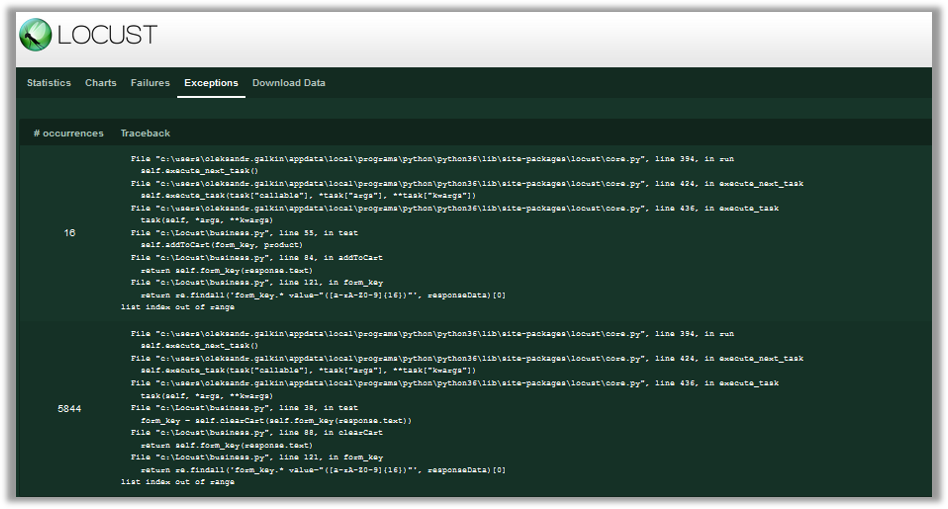
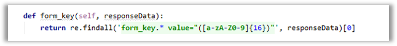
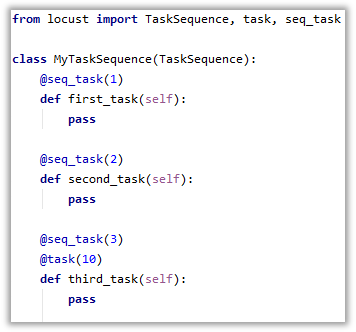
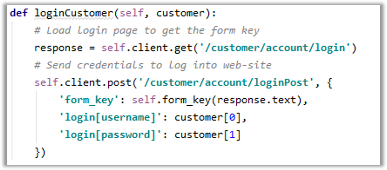

# Locust exercises

## Exercise 1 - avoid exceptions

* There are 2 exceptions in `clearCart` and `addToCart` method in `business.py` – please, update code to avoid raising exceptions

* Use some variable to save result returned by `findall` and validate it before usage (in `form_key` method)

* *Hint:* you can check list length by using len function

## Exercise 2 - Refactoring code with a little help of TaskSequence

* Use `TaskSequence` instead of `TaskSet` in `business.py` to increase test readability. Use example for reference.

* Each step should be moved into separate task
* Tasks should be ordered using `@seq_task` decorator\
* Move initialization to `on_start` method - each test run will contain one full iteration,
so data should be initialized before each run 
* Adding product to cart should be represented as a single task with `@task` decorator.
Use `products_left` as `weight` argument

## Exercise 3 - loginCustomer errors handling

* Currently, `business.py` test only tries to login using provided credentials, without checking the result

* For some reason, provided credentials may be wrong – please, check the response of `loginPost` request
* *Hint:* use `allow_redirects=False` and response.headers attribute to check the redirection URL
* *Hint:* you can use `print()` function to output variable value to console while running test.
If there is no need to continue test after printing data – use `exit()` function to terminate the script
Alternatively, you can debug code using PyCharm
* *Hint:* complex data types (list, dictionary) can be converted to human-readable structured text for 
printing using `json.dumps(var, indent=2)`

